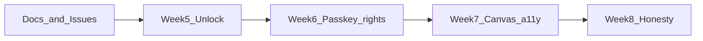

# Penumbra Weeks 5–8 enhancement roadmap

Canonical spec for GitHub Issues #15–#22. Development board: [docs/github.md](github.md). Principles: [AGENTS.md](../AGENTS.md). Versioning: [docs/versioning.md](versioning.md).

This is process, not a product feature. No in-studio Kanban.

Stay inside [AGENTS.md](../AGENTS.md): one ritual, cloud real when configured, passkeys first, EN 301 549 bar, TDD, making-of in lockstep. No in-studio Kanban, sharing, or extra dashboards.

## Shipped — Weeks 1–4 (#6–#13)

Landed on `main` as **v1.1.0** ([PR #14](https://github.com/sebbeflebbe/penumbra/pull/14)). Retrospective: [docs/story/09-roadmap.md](story/09-roadmap.md).

- #6 Edit and delete human slips (restricted `deleteNode`, `paper_slip.dart`)
- #7 Move handle + acknowledge recovery phrase
- #8 Board rename, delete, Art. 18 restrict
- #9 Persist `ConsentKind.remoteEcho` + erase re-auth
- #10 Cloud WebAuthn passkeys (phrase wrap; in-memory still fake)
- #11 Unavailable-path tests + honest copy
- #12 A11y lockstep after new controls
- #13 Env / imprint / ADR / story / OSV hygiene

The full Week 1–4 issue text is in git at that merge. Do not re-open those issues.

## Frozen constraints (every week)

- **Do not bump Forui.** Pinned at `forui: 0.22.2` because 0.26 needs Flutter 3.47 ([docs/adr/001-stack.md](docs/adr/001-stack.md)). CI is `FLUTTER_VERSION: "3.44.1"` in [`.github/workflows/ci.yml`](../.github/workflows/ci.yml).
- **Do not bump Flutter** in CI unless a CVE forces it; if you must, re-evaluate Forui (likely blocked).
- Domain has no Flutter and no Supabase. Tests use [InMemoryStudio](../lib/features/studio/in_memory_studio.dart). CI never gets `SUPABASE_*` dart-defines.
- Card bodies stay AES-256-GCM in the browser. Echoes still send **one slip** after Art. 6(1)(a), or local ([docs/adr/007-echo.md](adr/007-echo.md)).
- Honesty: no CE / NIS2 entity / ISO 27001 / full EAA claims.
- In-memory OAuth / passkey / magic stay **fake**. Do not make them real.
- **WebAuthn PRF is not a committed issue.** Phrase wrap stays the DEK story ([docs/adr/002-key-wrapping.md](adr/002-key-wrapping.md)).

## Current versions (baseline)

- App on `main` after this spec PR: `1.1.1+3` in [pubspec.yaml](../pubspec.yaml) (docs-only patch). Product work for #15–#22 starts on `minor/v1.2.0-…` at **`1.2.0+4`** (never reuse a build number).
- SDK: `^3.12.1`; Flutter CI `3.44.1`
- Notable deps: `forui 0.22.2`, `flutter_riverpod ^2.6.1`, `go_router ^15.1.2`, `cryptography ^2.7.0`, `supabase_flutter ^2.9.0`, `web ^1.1.1`, `flutter_lints ^6.0.0`
- App version stays `1.1.1+3` on this spec branch. The first product PR bumps to **`1.2.0+4`**. Week 8 (#22) is the honesty pass on that product PR (or a follow-up on the same minor), not a second SemVer bump.

## Known code facts the issues must name

- Cloud hydrate can leave a signed-in `AuthUser` with `_sessionDek == null` when wrap exists in `profiles` but the local device store does not ([supabase_studio.dart](../lib/features/studio/supabase_studio.dart) ~865–898). `listNodes` then returns `UnauthenticatedFailure` (~487–489). Password sign-in treats a missing DEK as `InvalidCredentialsFailure` (~114–116); OAuth/passkey session restore does not. There is **no** `unlockWithRecoveryPhrase` on [AuthRepository](../lib/features/auth/domain/auth_models.dart).
- Device wrap keys: `penumbra.device_key.$userId` / `penumbra.device_wrapped.$userId` via `_rememberDevice` / `_unlockDevice` (~968–990).
- `registerPasskey()` is implemented on both studios ([in_memory_studio.dart](../lib/features/studio/in_memory_studio.dart) ~250, [supabase_studio.dart](../lib/features/studio/supabase_studio.dart) ~251). **No widget calls it.** In-memory already adds `AuthMethod.passkey` on the current account.
- `hasGrantedConsent` is `.any(kind && granted)` ([privacy_models.dart](../lib/features/privacy/domain/privacy_models.dart) ~105–107). A later `granted: false` row **does not** withdraw. Canvas loads that helper into `_echoConsented` ([canvas_page.dart](../lib/features/canvas/presentation/canvas_page.dart) ~72–75).
- Privacy UI: Export + Copy JSON + Erase. No withdraw control, no display-name field, no file download ([privacy_page.dart](../lib/features/privacy/presentation/privacy_page.dart)). Export JSON already includes `displayName` (~735 / ~674). `profiles.display_name` exists ([0001_init.sql](../supabase/migrations/0001_init.sql)). Legal catalog names access, port, restrict, erase — **not Art. 16** ([legal_catalog.dart](../lib/features/legal/presentation/legal_catalog.dart) ~28).
- [canvas_page.dart](../lib/features/canvas/presentation/canvas_page.dart) is ~1230 lines. `paper_slip.dart` is extracted. Still inlined: `_Atelier` (~587), `_ComposeBar` (~839), `_CardIndex` (~952). Index is a `ListView` of `GestureDetector`s; no roving tabindex; no position announce after Move.
- [docs/story/01-stack.md](story/01-stack.md) still says “planned Supabase EU path”. ADR-001 and making-of chapter 01 already say live Frankfurt. Chapter 09 is the last catalog chapter ([story_catalog.dart](../lib/features/story/data/story_catalog.dart)).
- Board **Restrict** has a widget test ([board_lifecycle_test.dart](../test/features/boards/board_lifecycle_test.dart)). Rename/delete UI do not. Move is domain-tested ([node_motion_test.dart](../test/features/boards/node_motion_test.dart)), not as a widget. `registerPasskey` has no contract test.

---

## Week 5 — Encryption honesty

**Goal.** A signed-in cloud session can decrypt again after the device wrap is gone, and Art. 6(1)(a) echo consent is withdrawable.

### Issue #15 — Phrase unlock when the device wrap is gone

**Why.** OAuth and passkey users wrap the DEK with a twelve-word phrase shown once. Returning on a new browser (or after clearing site data) hydrates the Auth session, finds `wrap_salt` / `wrapped_dek`, fails `_unlockDevice`, and leaves `_sessionDek == null`. The person is “signed in” with an empty studio. That is an interview killer: the phrase was the honesty of ADR-002, and there is no field to type it.

**Acceptance**

- Add `AuthRepository.unlockWithRecoveryPhrase(String phrase)` (name may vary; keep it named and domain-level). Wrong checksum / wrong phrase → `InvalidCredentialsFailure` (or a dedicated failure with honest copy). Success unwraps, sets `_sessionDek`, `_rememberDevice`, and canvas `listNodes` works.
- UI: when `current != null` and the studio cannot decrypt (session without DEK), show a **locked studio** surface — not a blank board. Named field + **Unlock** (48px-class). Do not dump the person back to password sign-in if their method is OAuth/passkey.
- In-memory: expose a test seam so contract tests can drop the session DEK (or skip device remember) and still round-trip the phrase. Do not change demo `enterDemoStudio` (it has a wrapping secret, not a user-facing phrase).
- 12 words, existing checksum rules. Do not log the phrase. Do not persist plaintext phrase.
- Semantics: `Unlock with recovery phrase`. Reduced motion: no extra animation.

**Implementation**

- Domain first on `InMemoryStudio`, then the same method on `SupabaseStudio` (call existing `_unwrapDek` with the typed phrase).
- Prefer a small widget on canvas or boards (`locked_studio.dart`) rather than a new route. Chrome can stay signed-in (Sign out still works).
- Password users who already unwrap with the password on sign-in should not see this surface.
- After unlock, `announce` “Notes unlocked.”

**Files**

- [lib/features/auth/domain/auth_models.dart](../lib/features/auth/domain/auth_models.dart)
- [lib/features/studio/in_memory_studio.dart](../lib/features/studio/in_memory_studio.dart), [lib/features/studio/supabase_studio.dart](../lib/features/studio/supabase_studio.dart)
- Canvas or boards presentation; possibly [lib/shared/widgets/chrome.dart](../lib/shared/widgets/chrome.dart)
- [test/features/studio_contract_test.dart](../test/features/studio_contract_test.dart)
- New widget test `test/features/auth/phrase_unlock_test.dart` (`pumpStudio` pattern from [echo_ritual_test.dart](../test/features/canvas/echo_ritual_test.dart))

**Tests (TDD first)**

- Domain: federated sign-in → acknowledge phrase → drop session DEK / device wrap → `listNodes` fails or returns unauthenticated → `unlockWithRecoveryPhrase` with the saved phrase → nodes decrypt. Wrong phrase fails and DEK stays null.
- Widget: pump locked chrome → enter phrase → Unlock → seeded slip text visible.
- Existing recovery-phrase **ack** test stays green ([recovery_phrase_ack_test.dart](../test/features/canvas/recovery_phrase_ack_test.dart)).

**Difficulties**

- In-memory accounts keep `dek` on the account object; you must simulate “wrap exists, session DEK gone” without deleting the wrap secret. Add `debugLockSession()` (or equivalent) rather than hacking private fields from tests.
- Cloud: `_onSession` currently `_setCurrent` even when `dek == null`. After this issue, that state must be distinguishable in the UI (`needsPhraseUnlock` on `AuthUser`, or a studio getter). Do not overload `needsRecoveryPhraseReveal` (that means “copy this new phrase”).
- BIP39 checksum vs “any 12 words”: follow whatever `_newPhrase` already uses; don’t invent a second wordlist.

**Deps / bumps.** None.

**Docs.** One sentence in ADR-002: phrase is also the **re-unlock** secret, not only first-wrap. Story 02 if the copy still implies “shown once and then unused.”

**Out of scope.** WebAuthn PRF. Changing the wrap algorithm. Syncing device wrap across browsers without the phrase.

### Issue #16 — Withdraw remote-echo consent (Art. 7(3))

**Why.** Week 2 persisted `remoteEcho` across sessions and explicitly skipped withdraw. Grant is forever. Art. 7(3) requires it to be as easy to withdraw as to give. Canvas uses `hasGrantedConsent`, which is true if **any** historical row is granted — a new `granted: false` row would be ignored.

**Acceptance**

- Privacy page: named control **Withdraw echo consent** (visible when the latest `remoteEcho` event is granted). Confirm with Forui dialog (same pattern as erase/delete). After withdraw, announce and canvas summons the consent dialog again.
- `recordConsent(ConsentKind.remoteEcho, granted: false)` appends a row. **Do not delete** historical consent rows (audit). Change `hasGrantedConsent` to **latest-wins** per kind (sort by `at`, then granted flag).
- Export JSON still lists all events; UI copy says withdrawal does not erase past echoes already on the board.
- Local composer (`remote == false`) still never records `remoteEcho`.
- 48px-class; keyboard-reachable confirm.

**Implementation**

- Fix `hasGrantedConsent` in domain first; existing canvas `_echoConsented` and [echo_ritual_test.dart](../test/features/canvas/echo_ritual_test.dart) keep working if they only grant once.
- After withdraw, canvas must not keep a stale `_echoConsented == true`. Reload consents on privacy navigation back, or watch consents. Simplest: set `_echoConsented` from latest event inside `_confirmRemoteEcho` and on `_load`; if the person withdraws on another route, next canvas `_load` (or a provider listen) picks it up. Accept “next Summon” if live listen is heavy — but opening the same board without a full app reload should notice. Prefer invalidating after `recordConsent` returns.
- No SQL migration (`kind` is `text`; `granted` is already bool).

**Files**

- [privacy_models.dart](../lib/features/privacy/domain/privacy_models.dart), both studios `recordConsent`
- [privacy_page.dart](../lib/features/privacy/presentation/privacy_page.dart), [canvas_page.dart](../lib/features/canvas/presentation/canvas_page.dart)
- [studio_contract_test.dart](../test/features/studio_contract_test.dart), [echo_ritual_test.dart](../test/features/canvas/echo_ritual_test.dart)
- New `test/features/privacy/consent_withdraw_test.dart` (domain + widget)

**Tests (TDD first)**

- Domain: grant then withdraw → `hasGrantedConsent` is false; export still contains both rows.
- Domain: grant, withdraw, grant again → latest true.
- Widget: remote fake composer (already in echo_ritual) → agree → Privacy → Withdraw → confirm → back to canvas → Summon shows the Art. 6(1)(a) dialog again.

**Difficulties**

- Clock-equal timestamps: if tests insert two rows in the same millisecond, define a stable tie-break (row order / id). Use `clock` already in the project.
- Don’t treat `necessaryStorage` withdraw as in scope (necessary storage is not optional).

**Deps / bumps.** None.

**Docs.** Privacy policy sentence: echo consent can be withdrawn from Privacy. [legal_catalog.dart](../lib/features/legal/presentation/legal_catalog.dart) + [docs/privacy/policy.md](privacy/policy.md) if that file still omits Art. 7(3).

**Out of scope.** Withdrawing terms-of-use. Deleting Gemini’s copy of a past in-flight slip (we never stored it).

---

## Week 6 — Passkeys first + rights

**Goal.** Password users can add a passkey. Art. 16 rectify and Art. 20 download match the legal copy.

### Issue #17 — Register a passkey from an existing session

**Why.** Sign-in already leads with passkeys. `registerPasskey()` exists and is unused. Password (and OAuth) users cannot add a platform authenticator later. “Passkeys first” is incomplete.

**Acceptance**

- Named control **Add a passkey** after sign-in. Prefer Privacy or Boards chrome (signed-in), not a new settings app. If the session already has `AuthMethod.passkey`, hide or disable with copy “A passkey is already on this account.”
- In-memory: existing method stays a **fake** success and adds the method. CI must not need an authenticator.
- Cloud: existing `auth.passkey.startRegistration` / `verifyRegistration` path. Cancel → `AuthCancelledFailure`. Unsupported → reuse `passkeyUnavailable` copy from #11. **No silent fallback to password.**
- After success, `AuthUser.methods` contains `passkey`; announce “Passkey added.”
- Do not add a second identity SDK.

**Implementation**

- Call `authRepositoryProvider.registerPasskey()` from the signed-in surface. Busy state like sign-in `_busyId`.
- In-memory contract test: password sign-up → `registerPasskey` → methods include passkey; signed-out → unavailable.
- Widget: Enter studio (demo already has passkey — use password sign-up in the test studio, not `enterDemoStudio`).

**Files**

- [sign_in_page.dart](../lib/features/auth/presentation/sign_in_page.dart) only if you put the control there for signed-in visits; otherwise [privacy_page.dart](../lib/features/privacy/presentation/privacy_page.dart) or [boards_page.dart](../lib/features/boards/presentation/boards_page.dart)
- Both studios (copy only if errors are unclear)
- [studio_contract_test.dart](../test/features/studio_contract_test.dart)
- New `test/features/auth/register_passkey_test.dart`

**Tests (TDD first)**

- Domain: signed-out register fails; password user register succeeds in memory.
- Widget: find `Add a passkey` → tap → find `Passkey added` or equivalent status.
- [passkey_unavailable_test.dart](../test/features/auth/passkey_unavailable_test.dart) stays green.

**Difficulties**

- Demo studio already lists passkey on the account — widget tests that `enterDemoStudio` will not show Add. Seed a password-only user.
- Cloud: registering a passkey does **not** change the DEK wrap (still phrase or password). Don’t promise PRF here.
- Operator: Frankfurt project must already have Passkeys enabled (same as #10).

**Deps / bumps.** None unless `supabase_flutter` 2.x requires a patch already allowed by versioning.

**Docs.** Story 02: “from an existing session you can add a passkey.” README Auth section one line.

**Out of scope.** Multiple passkeys UI. Conditional UI / autofill. Cross-device QR. Making in-memory WebAuthn real.

### Issue #18 — Art. 16 display name + Art. 20 downloadable export

**Why.** Legal copy promises access and port. Export is on-page JSON + clipboard. There is no profile rectify. `displayName` is already in the export payload and `profiles.display_name` exists; UI never writes it (except demo `'Ada'`).

**Acceptance**

- Privacy: field **Display name** + **Save** (Art. 16). Empty allowed (clears to null). Persist in both studios. Export `displayName` matches. Chrome does not need to show the name (no extra identity chrome).
- Privacy: **Download JSON** beside **Copy JSON**. Web: `Blob` + temporary `<a download="penumbra-export.json">` via `package:web` (already a dep). Filename honest. Don’t POST the bundle anywhere.
- Legal catalog / privacy policy: name Art. 16 rectification and Art. 20 as a file, not only clipboard.
- 48px-class; Semantics `Download export as JSON`, `Save display name`.

**Implementation**

- Add `updateDisplayName(String? name)` on privacy or auth repository — one place, both studios. Cloud: `profiles` upsert `display_name` only (do not clobber `wrap_salt` / `wrapped_dek`). In-memory: `_Account.displayName`.
- Download helper in a tiny `lib/core/web/download_blob.dart` (or privacy presentation) so widget tests can stub it. Don’t crash `flutter test` (IO, not `dart:html`).

**Files**

- [privacy_page.dart](../lib/features/privacy/presentation/privacy_page.dart), both studios, [privacy_repository.dart](../lib/features/privacy/domain/privacy_repository.dart)
- [legal_catalog.dart](../lib/features/legal/presentation/legal_catalog.dart), [docs/privacy/policy.md](privacy/policy.md)
- [studio_contract_test.dart](../test/features/studio_contract_test.dart)
- New `test/features/privacy/export_download_test.dart`

**Tests (TDD first)**

- Domain: set display name → `exportMine().account['displayName']` (or equivalent) matches; cloud path tested only in memory.
- Widget: Export my data → Download JSON visible; Copy JSON still works.
- Widget: save display name → status “Display name saved.”

**Difficulties**

- `package:web` in unit tests: inject a callback rather than hitting real Blob.
- Profiles upsert in cloud must not null out wrap columns — read-modify or send only `id` + `display_name` if PostgREST merge allows it. Verify against existing `_persistWrap` upsert shape (~957–961).

**Deps / bumps.** None.

**Docs.** Legal + privacy policy. No new ADR.

**Out of scope.** Changing email. Avatar. Exporting ciphertext instead of plaintext (export is the data-subject copy; it is decrypted).

---

## Week 7 — Ritual maintainability + a11y

**Goal.** `canvas_page.dart` is splittable. Index and Move are a stronger mitigation for InteractiveViewer still not being a spatial map.

### Issue #19 — Split `canvas_page.dart` with no behaviour change

**Why.** The file grew from ~1067 lines (Week 1 fact) to ~1230 after `paper_slip.dart`. `_Atelier`, `_ComposeBar`, and `_CardIndex` are still private. Week 7 a11y (#20) will be unsafe in a 1200-line state class.

**Acceptance**

- Extract at least `_Atelier`, `_ComposeBar`, `_CardIndex` (and painters if they move cleanly) to `lib/features/canvas/presentation/`. Public or library-private (`atelier.dart`, `compose_bar.dart`, `card_index.dart`) — no new product chrome.
- Existing canvas widget tests stay green with **no** assertion changes except imports if needed: [echo_ritual_test.dart](../test/features/canvas/echo_ritual_test.dart), [slip_edit_delete_test.dart](../test/features/canvas/slip_edit_delete_test.dart), [recovery_phrase_ack_test.dart](../test/features/canvas/recovery_phrase_ack_test.dart).
- `dart analyze --fatal-warnings` clean. Visual parity: borders, Fraunces numerals, copper selected state, compose Place/Swatch/Summon.

**Implementation**

- Move widgets first; keep `_CanvasPageState` as the orchestrator (load, consent, drag flag, focus index). Pass callbacks. Do not introduce a canvas Riverpod notifier unless tests force it.
- Painters can stay in `atelier.dart`.
- Do this **before** #20 so a11y lands on the extracted Index.

**Files**

- [canvas_page.dart](../lib/features/canvas/presentation/canvas_page.dart) and new presentation files
- Widget tests listed above (should not need rewrites)

**Tests (TDD first)**

- No new behaviour tests required. Run the existing canvas suite; if extraction breaks finder text (`Place`, `Index`, `Private by default.`), fix the extraction, not the tests.

**Difficulties**

- Private closures and `ref` in the state class. Prefer explicit callbacks over `WidgetRef` in children.
- `InteractiveViewer` `panEnabled: !_dragging` must keep working after Atelier extraction.

**Deps / bumps.** None.

**Docs.** None unless making-of mentions the file size.

**Out of scope.** Redesign. New panels. State-management rewrite.

### Issue #20 — Index / Move a11y deepening

**Why.** Statement already admits InteractiveViewer is not a spatial map; Index + Move are the mitigation ([docs/accessibility/statement.md](accessibility/statement.md)). Index is mouse-tap `GestureDetector`s. Move announces “Moved” today if that was wired in #7 — verify and deepen: restore focus, speak position, keyboard roving on Index.

**Acceptance**

- Index items are focusable controls (roving tabindex **or** a list where arrow keys move selection without trapping the whole page). Current selected slip stays in sync with `_focusedIndex`.
- After Move (handle pointer-up or keyboard nudge), `announce` includes enough to reorient (e.g. “Moved. Card II, column …”) — keep copy short. Focus returns to the slip or the Move handle, not the document body.
- Semantics labels already exist on Index rows (~1016–1021); keep them. Add `Focus` / `Shortcuts` rather than new visible chrome.
- Statement date bump; known gaps **still** include InteractiveViewer-as-non-map and Flutter web overlay. **No full EAA claim.** Partial EN 301 549.
- High-contrast: Index selection border still true B/W. Reduced motion: no extra animation.

**Implementation**

- Work in extracted `card_index.dart` from #19. Reuse [motion.dart](../lib/core/a11y/motion.dart) `announce`.
- Keyboard: Up/Down in Index changes focus; Enter/Space selects (if tap already selects, keep that). Don’t steal canvas arrow-nudge when focus is on the sheet.
- Widget test with `disableAnimations`, 1400×900, `enterDemoStudio` / Open.

**Files**

- Extracted Index + [canvas_page.dart](../lib/features/canvas/presentation/canvas_page.dart) / [paper_slip.dart](../lib/features/canvas/presentation/paper_slip.dart) (Move handle)
- [legal_catalog.dart](../lib/features/legal/presentation/legal_catalog.dart), [docs/accessibility/statement.md](accessibility/statement.md)
- New `test/features/canvas/index_a11y_test.dart`

**Tests (TDD first)**

- Widget: Open seeded board → Index has Semantics selected on the focused card.
- Widget: tap Index row → corresponding slip selected (already true; keep).
- Widget: Move handle — after drag or a testable `onMoved` callback, `announce` / semantics live region updated. If full drag vs `InteractiveViewer` is still flaky in CI, test keyboard nudge announce instead and keep one Move-handle `find.bySemanticsLabel('Move')` smoke.

**Difficulties**

- Flutter web semantics overlay remains. Don’t “fix” it with a Forui bump.
- Roving tabindex vs Flutter `FocusTraversalGroup` — pick one; document in the issue comment when landed.
- Don’t claim a canvas map.

**Deps / bumps.** None.

**Docs.** A11y statement + catalog accessibility page. Story 03 one sentence if Index behaviour is now stronger than “a list beside the canvas.”

**Out of scope.** Full spatial accessibility tree for `InteractiveViewer`. Screen-reader virtual cursor mapping of x/y pixels.

---

## Week 8 — Honesty pass

**Goal.** Tests cover shipped UI. Making-of, origin, and version agree with Weeks 5–7. Product version **`1.2.0+4`**.

### Issue #21 — Test holes for already-shipped UI

**Why.** Domain contract is strong. Widget coverage skipped several Week 1–2 surfaces: board rename/delete, Move handle, `registerPasskey`, privacy export/erase. Interview TDD story is weaker than the code.

**Acceptance**

- Widget (in-memory, `pumpStudio`, disable animations, 1400×900):
  - Board **Rename** (change title, chrome or list shows it) and **Delete** (confirm; board gone). Restrict test stays.
  - Move handle present on a selected human slip (`find.bySemanticsLabel` or named **Move**). Domain [node_motion_test.dart](../test/features/boards/node_motion_test.dart) stays the source of truth for deltas.
  - Privacy: Export my data shows JSON; Erase with demo/password path does not crash (demo is password+passkey — use the erase password field rules already on the page).
- Domain: `registerPasskey` if #17 didn’t already add it; erase + export already in [studio_contract_test.dart](../test/features/studio_contract_test.dart) — don’t duplicate, extend.
- CI: `flutter test` still has no `SUPABASE_*`.

**Implementation**

- Extend [board_lifecycle_test.dart](../test/features/boards/board_lifecycle_test.dart) rather than a fourth pump helper — **or** extract `pumpStudio` to `test/helpers/pump_studio.dart` if copy-paste is now 4+ files.
- Don’t fight InteractiveViewer for a pixel-perfect drag in CI.

**Files**

- Existing test files above; maybe `test/helpers/pump_studio.dart`
- [privacy_page.dart](../lib/features/privacy/presentation/privacy_page.dart) only if finders need keys (prefer text finders)

**Tests (TDD first)**

- This issue **is** the tests. Write failing finders first if the widget labels are missing; then fix labels (that is a11y, not scope creep).

**Difficulties**

- Delete board confirm dialog: named buttons, same Forui pattern. Finder collisions with slip **Delete**.
- Erase navigates to `/` — assert landing, not a leftover `/privacy` session.

**Deps / bumps.** None.

**Docs.** None.

**Out of scope.** Golden screenshots. Live Supabase integration tests.

### Issue #22 — Story / ADR / origin runbook / 1.2.0 honesty

**Why.** [docs/story/01-stack.md](story/01-stack.md) still says “planned Supabase.” Chapter 09 is a closed retrospective of Weeks 1–4. Passkeys fail if `PENUMBRA_ORIGIN` ≠ the Pages origin. Branch protection is still a manual reminder ([docs/versioning.md](versioning.md)). Product work on this cycle must not stay `1.1.1+3`.

**Acceptance**

- Fix `docs/story/01-stack.md` to match ADR-001 / catalog chapter 01 (live Frankfurt; in-memory mirrors it).
- Add chapter **10** (docs file + [story_catalog.dart](../lib/features/story/data/story_catalog.dart)): retrospective of Weeks 5–8 — phrase re-unlock, Art. 7(3), register passkey, Art. 16/20 download, canvas split, Index a11y. Name what stayed fake (in-memory federated auth, PRF).
- Operator runbook: short [docs/ops.md](ops.md) (or README section) — `PENUMBRA_ORIGIN` must equal the Cloudflare Pages HTTPS origin; Passkeys enabled on the Frankfurt Auth settings; `CLOUDFLARE_PROJECT_NAME` + tokens for deploy; optional GitHub setting: require **analyze**, **test**, **build-web**, **supply-chain** on `main`.
- ADR-002: re-unlock with phrase (from #15) noted; PRF still future.
- `pubspec.yaml` **1.2.0+4** on the product branch (not on the 1.1.1 spec PR).
- A11y statement date matches the week this lands. Still partial EN 301 549.

**Implementation**

- Catalog body and `docs/story/10-*.md` stay in lockstep (same as chapter 09).
- Don’t invent a real controller email.

**Files**

- Story catalog + `docs/story/01-stack.md` + new chapter 10
- [docs/adr/002-key-wrapping.md](adr/002-key-wrapping.md)
- README and/or `docs/ops.md`
- [pubspec.yaml](../pubspec.yaml) / lock only if #22 is the last commit on the 1.2.0 PR
- [docs/accessibility/statement.md](accessibility/statement.md) if #20 didn’t already bump the date

**Tests**

- `flutter test` + analyze. No new unit tests required unless catalog is parsed in tests (it isn’t).

**Difficulties**

- Chapter 10 must be written **after** #15–#21 exist, or it will promise work that slipped. If a slice is dropped, say so in the chapter.
- Don’t claim Cloudflare is configured if `CLOUDFLARE_PROJECT_NAME` is empty.

**Deps / bumps.** None required. `flutter pub upgrade` without Forui major only if OSV forces it (same rule as #13).

**Out of scope.** Auto-tagging `v1.2.0`. Turning on branch protection from this repo (GitHub UI / admin). PRF.

---

## GitHub issue bodies (paste as-is)

Each issue uses this skeleton; fill from the sections above:

- Title: as in `#15`–`#22` headings
- Labels: `week-N`
- Body sections: **Why** · **Acceptance** · **Implementation** · **Files** · **Tests (TDD first)** · **Difficulties** · **Deps / bumps** · **Docs** · **Out of scope**

Do not open empty issues and “fill later”. The board is the interview process artifact.

## What we will not schedule

- In-studio process boards, sharing, multiplayer, mobile, extra model vendors
- CE / NIS2 / ISO / full EAA claims
- Supabase integration tests in CI
- Forui 0.26 / Flutter 3.47
- WebAuthn PRF as a committed deliverable
- Making in-memory OAuth / passkey / magic real
- Auto-tagging as a required deliverable

## Cadence

Each coding week: failing domain test → studio both paths → UI → widget test → making-of/ADR touch → `gh issue close`. Reviewers keep using **Enter the studio** (in-memory). Cloud checks need both `SUPABASE_*` dart-defines, WebAuthn enabled on the Frankfurt project, and `PENUMBRA_ORIGIN` equal to the Pages origin.

Product implementation: branch `minor/v1.2.0-{slug}` from up-to-date `main`, bump to `1.2.0+4`, PR title `v1.2.0:`. This spec PR is `patch/v1.1.1-next-cycle-roadmap` only.
