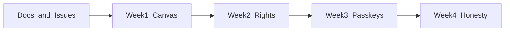

# Penumbra four-week enhancement roadmap

Canonical spec for GitHub Issues #6–#13. Development board: [docs/github.md](github.md). Principles: [AGENTS.md](../AGENTS.md).

This is process, not a product feature. No in-studio Kanban.

Stay inside [AGENTS.md](../AGENTS.md): one ritual, cloud real when configured, passkeys first, EN 301 549 bar, TDD, making-of in lockstep. No in-studio Kanban, sharing, or extra dashboards.

## Frozen constraints (every week)

- **Do not bump Forui.** Pinned at `forui: 0.22.2` because 0.26 needs Flutter 3.47 ([docs/adr/001-stack.md](docs/adr/001-stack.md)). CI is `FLUTTER_VERSION: "3.44.1"` in [`.github/workflows/ci.yml`](.github/workflows/ci.yml).
- **Do not bump Flutter** in CI unless a CVE forces it; if you must, re-evaluate Forui (likely blocked).
- Domain has no Flutter and no Supabase. Tests use [InMemoryStudio](lib/features/studio/in_memory_studio.dart). CI never gets `SUPABASE_*` dart-defines.
- Card bodies stay AES-256-GCM in the browser. Echoes still send **one slip** after Art. 6(1)(a), or local ([docs/adr/007-echo.md](docs/adr/007-echo.md)).
- Honesty: no CE / NIS2 entity / ISO 27001 / full EAA claims.

## Current versions (baseline)

- App: `1.0.0+1` in [pubspec.yaml](pubspec.yaml)
- SDK: `^3.12.1`; Flutter CI `3.44.1`
- Notable deps: `forui 0.22.2`, `flutter_riverpod ^2.6.1`, `go_router ^15.1.2`, `cryptography ^2.7.0`, `supabase_flutter ^2.9.0`, `web ^1.1.1`, `flutter_lints ^6.0.0`
- App version stays `1.0.0+1` through Weeks 1–3; Week 4 bumps to **`1.1.0+2`** once the ritual UI matches the domain.

## Known code facts the issues must name

- Canvas UI is one ~1067-line file: [lib/features/canvas/presentation/canvas_page.dart](lib/features/canvas/presentation/canvas_page.dart). Extract when touching it; do not grow it blindly.
- `CanvasRepository.delete` already exists and **cascades child echoes** in both studios. UI only calls it from `_dismissEcho`.
- `deleteNode` in memory ([in_memory_studio.dart](lib/features/studio/in_memory_studio.dart) ~471) and cloud ([supabase_studio.dart](lib/features/studio/supabase_studio.dart) ~448) **does not check `board.restricted`**. `upsert` does. Exposing human-delete without that check breaks Art. 18.
- `_nudge` already moves a parent’s echo by the same delta (~163–186) but **swallows** upsert errors (`err: (_) {}`). Restricted boards fail silently today.
- Recovery phrase `FAlert` is shown when `pendingRecoveryPhrase != null` (~431–438) but nothing calls `acknowledgeRecoveryPhrase()`.
- Echo consent is a canvas field `_echoConsentedThisSession`. `ConsentKind` is only `necessaryStorage | termsOfUse`. Table `consent_events.kind` is unconstrained `text` ([0001_init.sql](supabase/migrations/0001_init.sql)); no SQL enum migration required.
- Privacy erase UI calls `eraseAccount()` with **no password** ([privacy_page.dart](lib/features/privacy/presentation/privacy_page.dart) ~40). Studio contract already requires the password ([studio_contract_test.dart](test/features/studio_contract_test.dart) ~115).
- Cloud passkeys always `AuthUnavailableFailure` ([supabase_studio.dart](lib/features/studio/supabase_studio.dart) ~177–189). In-memory fakes a session as `passkey-ada@penumbra.studio`.
- `.env.example` still has `LUMEN_*`; [config.dart](lib/core/config.dart) already reads `PENUMBRA_*`.

---

## Week 1 — Finish the canvas ritual

**Goal:** Place is not write-only. Keep Index, hairlines, and encryption behaviour identical.

### Issue #6 — Edit and delete human slips

**Why.** `_PaperSlip` only offers Dismiss for echoes. Humans can Place forever and never correct a typo. `CanvasRepository.delete` and echo cascade are already implemented.

**Acceptance**

- Selected **text** (and **swatch**) slips expose named controls: **Edit** (text only), **Delete**. Echoes stay Dismiss-only; echo body is not editable.
- Edit: in-place field or compose-bar reuse; empty body refused; `upsert` re-encrypts the full payload (`toPayload()` already includes `text`/`x`/`y`/`parentId`).
- Delete human: confirm dialog with named buttons (not an icon-only trash). Studio cascade removes the child echo; UI drops both from `_nodes` and repairs `_focusedIndex`. Index numerals update via `EchoPairing.conversation`.
- Restricted board: delete and edit must `ForbiddenFailure` and `announce` the Art. 18 message. Domain test first: `deleteNode` on a restricted board is `ForbiddenFailure` (this is a **new** studio check, both implementations).
- 48px-class targets; Semantics labels (`Edit this note`, `Delete this note`). High-contrast: no extra shadow; reduced motion: no extra animation ([motion.dart](lib/core/a11y/motion.dart)).

**Implementation**

- Add `restricted` check to `deleteNode` in both studios (mirror `upsert`).
- Extract `_PaperSlip` (+ edit state) out of `canvas_page.dart` if the file would grow; prefer `lib/features/canvas/presentation/paper_slip.dart`.
- `_ComposeBar`: when a text slip is selected, Place can become Save, or keep Place and add Edit on the slip. Prefer slip-local edit so Index/canvas stay one ritual.
- Do not add a properties panel.

**Files**

- [lib/features/studio/in_memory_studio.dart](lib/features/studio/in_memory_studio.dart), [lib/features/studio/supabase_studio.dart](lib/features/studio/supabase_studio.dart) (`deleteNode`)
- [lib/features/canvas/presentation/canvas_page.dart](lib/features/canvas/presentation/canvas_page.dart), likely new `paper_slip.dart`
- [test/features/studio_contract_test.dart](test/features/studio_contract_test.dart)
- New `test/features/canvas/slip_edit_delete_test.dart` (widget, pattern from [echo_ritual_test.dart](test/features/canvas/echo_ritual_test.dart): `pumpStudio`, disable animations, 1400×900)

**Tests (write first)**

- Domain: delete human with echo → both gone; ciphertext gone from `debugCipherStorage`.
- Domain: restricted `deleteNode` → `ForbiddenFailure`.
- Widget: Enter studio → Open → select seeded “Private by default.” → Delete → confirm → text gone; Index no longer lists it.
- Widget: Edit that slip → Save → Index shows new text; `semanticsLabel` follows `BoardNode.semanticsLabel`.

**Difficulties**

- `canvas_page.dart` size and private widgets (`_PaperSlip`, `_Atelier`). Extraction will churn diffs; keep visual parity (borders, Fraunces numerals, copper selected state).
- Widget tests that tap slips inside `InteractiveViewer` are fragile (see existing `find.text('Private by default.').first`). Prefer `ensureVisible` + first match; set `disableAnimations`.
- Confirm dialog: Forui `showFDialog` already used for echo consent — reuse that pattern, not `AlertDialog`.
- Do not decrypt in the UI; only call `upsert`/`delete`.

**Deps / bumps.** None.

**Docs.** One paragraph in chapter 03 or 09 that Place is reversible. No ADR unless delete-on-restricted behaviour was undocumented (it was a hole).

**Out of scope.** Drag (issue #7). Echo body edit. Rich text.

### Issue #7 — Drag-move slips + acknowledge recovery phrase

**Why.** Arrow keys already persist via `_nudge` (16px). Pointer users cannot move. Recovery phrase alert never clears `needsRecoveryPhraseReveal`, so it can haunt the chrome forever.

**Acceptance**

- Pointer drag on a focused slip persists `x`/`y` through `upsert`. Keyboard nudge still works.
- Dragging a **text** parent moves its echo by the same delta (copy `_nudge` ~174–183). Then run existing `_untangleEchoes` if overlap.
- `InteractiveViewer` pan/zoom still works on empty sheet; drag on a slip must not pan the viewport (gesture conflict is the hard part).
- Reduced motion: drag still works; skip `penumbraCardAppear` extras only.
- Recovery phrase alert gains a named button **I have saved this phrase** → `acknowledgeRecoveryPhrase()`; phrase disappears; in-memory test already covers the API ([studio_contract_test.dart](test/features/studio_contract_test.dart) ~42–48).

**Implementation**

- Prefer a **Move** affordance on the selected slip (named, 48px) that captures pointer, rather than making the whole slip a `PanGesture` (that fights selection and InteractiveViewer). Alternative: `Listener` on the slip that sets `InteractiveViewer.panEnabled: false` while dragging.
- Snap optional: 8px grid to match 16px nudge; if snap, document it. Default: free drag, keyboard stays 16px.
- After pointer-up, `announce` “Moved” for SR users.
- Pass `onAcknowledgePhrase` from `_CanvasPageState` into `_Atelier`.

**Files**

- [canvas_page.dart](lib/features/canvas/presentation/canvas_page.dart) (`_nudge`, `_Atelier`, `InteractiveViewer` ~469)
- [auth_models.dart](lib/features/auth/domain/auth_models.dart) (already has the method)
- New widget test in `slip_edit_delete_test.dart` or `recovery_phrase_ack_test.dart`

**Tests**

- Widget: OAuth/passkey path in memory — GitHub sign-in is awkward in widget tests; easier to `enterDemoStudio` is wrong (demo has no phrase). Prefer a unit/widget with `InMemoryStudio.signInWithGitHub()` then pump `/boards/...`. If too heavy, a focused test that pumps canvas with a fake auth repo exposing `pendingRecoveryPhrase`.
- Drag: if widget gesture vs InteractiveViewer is too flaky in CI, extract `BoardNode movedBy(BoardNode node, double dx, double dy, {BoardNode? echo})` in domain (pure) and test that; keep one smoke widget test.

**Difficulties**

- **Highest Week-1 risk:** `InteractiveViewer` vs child `GestureDetector` arena. If pan steals the drag, users cannot move. If slip steals pan, the sheet cannot be explored. Must toggle `panEnabled` or use a dedicated handle.
- `_nudge` swallowing errors: while here, `announce` on `ForbiddenFailure` so Week 2 restrict UX is not silent.
- Flutter web pointer vs trackpad pinch — don’t disable scale (`minScale`/`maxScale` stay 0.5–2.5).

**Deps / bumps.** None.

**Out of scope.** Multi-select, alignment guides, undo stack.

---

## Week 2 — Board lifecycle and consent honesty

**Goal.** Legal copy already promises rename, Art. 18 restrict, export, erase. Domain already implements them. UI does not.

### Issue #8 — Board rename, delete, Art. 18 restrict

**Why.** [boards_page.dart](lib/features/boards/presentation/boards_page.dart) create+list only. Restricted is a badge (`board.restricted ? 'Restricted'` ~183). [BoardRepository](lib/features/boards/domain/board_repository.dart) already has `rename` / `delete` / `setRestricted`. Canvas compose bar does not know about restricted.

**Acceptance**

- Each board row: **Rename**, **Restrict** / **Unrestrict**, **Delete** (confirm). Named controls, 48px-class.
- Restrict → studios refuse `upsert`/`deleteNode` (after #6) → canvas shows a persistent `FAlert` and disables Place / Swatch / Summon / Edit / Delete / drag.
- Delete board: confirm; navigate away if the open canvas was that id (`go_router` `/boards`).
- Rename updates chrome title on next load (`PenumbraChrome title: _board!.title`).
- Widget test: restrict seeded board → Open → Place is absent or disabled; announce/alert contains `Art. 18`.

**Implementation**

- Boards page uses `FutureBuilder` once; keep `_boards` local mutations like `_create` already does.
- Canvas: `if (_board!.restricted)` short-circuit `_addNote` / `_addSwatch` / `_summonEcho` / `_nudge` / drag.
- Do not add a settings route; keep actions on the boards list (UX depth over chrome).

**Files**

- [boards_page.dart](lib/features/boards/presentation/boards_page.dart)
- [canvas_page.dart](lib/features/canvas/presentation/canvas_page.dart)
- New `test/features/boards/board_lifecycle_test.dart`
- Existing domain test `restricted boards refuse writes` stays; extend with delete.

**Difficulties**

- `FutureBuilder` will not refetch after rename if we only mutate `_boards` — that’s fine if we update local state.
- Cloud delete is RLS-owned; in-memory must match ([in_memory_studio.dart](lib/features/studio/in_memory_studio.dart) `delete`).
- Restricted **read** still allowed (export/privacy). Don’t hide the board.

**Deps / bumps.** None.

**Docs.** [legal_catalog.dart](lib/features/legal/presentation/legal_catalog.dart) already mentions Art. 18; no copy change unless the UI label differs. Touch [docs/privacy/policy.md](docs/privacy/policy.md) only if the flow changes.

### Issue #9 — Persist remote-echo consent + erase re-auth

**Why.** Remote Gemini path sets a session bool. Refresh = consent again (honest-ish) but export never shows `remoteEcho`. Erase button ignores `eraseAccount({password})`.

**Acceptance**

- Add `ConsentKind.remoteEcho`. `recordConsent` on agree in `_confirmRemoteEcho`. Later summons in this session skip the dialog if a granted event exists; **revocation** is not required this week (no “withdraw echo consent” UI), but a new session should still confirm unless a granted row exists (persisted = skip dialog). Choose **persist across sessions** (true Art. 6(1)(a) record) and document that withdraw is Week-4-or-later if time is gone.
- `_consentKind` unknown-name fallback today maps to `necessaryStorage` ([supabase_studio.dart](lib/features/studio/supabase_studio.dart) ~830). New enum value must parse `remoteEcho`; unknown stays fallback.
- Export JSON includes the new kind. [penumbraDataCategories](lib/features/privacy/domain/privacy_models.dart) already has “Optional echo (Gemini)”.
- Privacy page: password field (12+) for password users; for OAuth, copy that they must have signed in within 5 minutes (`reauthenticate` cloud branch ~227–230). Destructive Erase stays disabled until that is satisfied. Wrong password keeps the account ([studio_contract_test](test/features/studio_contract_test.dart)).
- After erase success, `go` landing / sign-in; don’t leave a dead `/privacy` session.

**Implementation**

- Canvas should call `privacyRepositoryProvider.recordConsent(ConsentKind.remoteEcho, granted: true)` — **do not** send the slip text to that API.
- No new SQL migration (kind is `text`). Optional `0004` only if we add a check constraint; skip unless we want DB-level enum (prefer skip — Dart is source of truth).
- Local composer (`composer.remote == false`) never records `remoteEcho`.

**Files**

- [privacy_models.dart](lib/features/privacy/domain/privacy_models.dart), both studios `recordConsent` / `_consentKind`
- [canvas_page.dart](lib/features/canvas/presentation/canvas_page.dart), [privacy_page.dart](lib/features/privacy/presentation/privacy_page.dart)
- [echo_ritual_test.dart](test/features/canvas/echo_ritual_test.dart) — today uses `LocalEchoComposer` so it **must not** require the dialog. Add a test with a fake `remote: true` composer that asserts the dialog copy (`Google LLC`, `Art. 6(1)(a)`) then records consent.

**Difficulties**

- Widget test for **remote** composer needs a fake `EchoComposer` with `remote == true` that does not hit Gemini. The production Gemini path needs `GEMINI_API_KEY`; CI has none.
- OAuth re-auth window is 5 minutes in cloud studio — document in UI; don’t invent a second OAuth popup this week.
- Enum addition is a breaking serialization change only if old clients see `remoteEcho` and fall back to `necessaryStorage` (misleading in export). Ship enum + parser together.

**Deps / bumps.** None.

---

## Week 3 — Passkeys that match the sign-in page

**Goal.** “Passkeys first” in [sign_in_page.dart](lib/features/auth/presentation/sign_in_page.dart) (~107) must not be a lie on Supabase.

### Issue #10 — Cloud WebAuthn passkeys (no PRF required)

**Why.** `signInWithPasskey` / `registerPasskey` on [SupabaseStudio](lib/features/studio/supabase_studio.dart) hard-return unavailable. ADR-002: wrap DEK with 12-word phrase until PRF exists. In-memory stays a **demo fake**.

**Acceptance**

- Cloud: `navigator.credentials` / `package:web` (already a dep) or `supabase_flutter` Auth WebAuthn API if present in 2.9+. If the plugin in 2.9 cannot do it, bump **`supabase_flutter` within 2.x only** (see bumps). Do not add a second auth SDK.
- Happy path (HTTPS or localhost, platform authenticator): register or sign in; session DEK still wrapped with recovery phrase on first passkey/OAuth user; phrase UI from #7 still applies.
- Missing WebAuthn, HTTP non-localhost, user abort: `AuthCancelledFailure` or `AuthUnavailableFailure` with honest copy. Button stays first in the layout. **No silent fallback to password.**
- RP ID = host of `PENUMBRA_ORIGIN` ([config.dart](lib/core/config.dart)). Cloudflare Pages deploy must use that origin; mismatch = passkeys fail. Document in README.
- `AuthMethod.passkey` already mapped from `'webauthn'` (~812). Keep that.

**Implementation order**

1. Spike: read `supabase_flutter` 2.9 Auth API for `signInWithWebauthn` / `getAuthenticatorAssuranceLevel`. If absent, check latest 2.x changelog **before** coding UI.
2. Implement behind `StudioMode.supabase` only.
3. Keep in-memory `signInWithPasskey` as fake (tests depend on it: [studio_contract_test.dart](test/features/studio_contract_test.dart) ~31).

**Files**

- [supabase_studio.dart](lib/features/studio/supabase_studio.dart), [sign_in_page.dart](lib/features/auth/presentation/sign_in_page.dart) (busy/error copy only)
- [docs/adr/002-key-wrapping.md](docs/adr/002-key-wrapping.md) — note “cloud WebAuthn shipped; PRF still future”
- [docs/story/02-auth.md](docs/story/02-auth.md) + catalog chapter 02 — “cloud passkeys are WebAuthn; demo studio still fakes”
- README Auth section

**Tests**

- No live authenticator in CI. Unit-test a small wrapper with a fake `WebAuthnGateway`: success, abort, unsupported.
- Existing in-memory passkey test **must remain green**.

**Difficulties (this is the hardest week)**

- Flutter web WebAuthn is poorly documented; `package:web` `CredentialsContainer` vs js-interop breakage across compilers.
- Supabase project must enable WebAuthn in Auth settings (manual console step — cannot be done from this repo alone). Issue must list: **operator step** on the Frankfurt project.
- Conditional UI / autofill passkeys: skip.
- Cross-device QR passkeys: skip.
- Safari vs Chromium PRF: **out of scope** (stretch below).
- Relying party ID vs `*.pages.dev` vs custom domain — getting this wrong looks like “passkeys broken”.
- Don’t store DEK server-side if the wrap path is painful. Recovery phrase remains the wrap.

**Deps / bumps**

- Allowed: `supabase_flutter` `^2.9.0` → latest compatible 2.x if required for WebAuthn. Re-run `flutter pub get` and CI OSV.
- Allowed: tiny helper only if supabase_flutter still has no API — prefer `package:web` already in pubspec, not a new `passkeys` plugin (those are often mobile-first).
- Forbidden: Forui bump, Flutter 3.47, Firebase Auth.

**Stretch (only if #10 lands before Wednesday):** WebAuthn PRF extension wraps DEK instead of recovery phrase when `prf` is in `getClientCapabilities`. If unsupported, keep phrase. Do not ship a half-PRF that drops keys.

### Issue #11 — Unavailable-path tests + honest copy

**Why.** Even after #10, many reviewers will run in-memory or HTTP. The button must explain why.

**Acceptance**

- Cloud without WebAuthn: existing `AuthUnavailableFailure` message, maybe tightened: “This browser cannot create a passkey. Use Google, GitHub, a magic link, or a password.”
- In-memory: keep working fake; making-of says so.
- [app_widget_test.dart](test/app/app_widget_test.dart) still finds `Continue with a passkey`.
- Sign-in errors go to `FAlert` (`_error`), not a snackbar.

**Files.** Sign-in page, supabase studio, story 02, ADR-002, new `test/features/auth/passkey_unavailable_test.dart` with a fake studio.

**Difficulties.** Don’t make in-memory start returning unavailable — that would break studio_contract and the demo.

**Deps / bumps.** None beyond #10.

---

## Week 4 — Honesty pass

**Goal.** Binary, making-of, env names, and a11y statement agree. App version `1.1.0+2`.

### Issue #12 — A11y lockstep after new controls

**Why.** Weeks 1–2 add Edit/Delete/Move/Restrict. Statement still only mentions Flutter web semantics overlay ([docs/accessibility/statement.md](docs/accessibility/statement.md), [legal_catalog.dart](lib/features/legal/presentation/legal_catalog.dart)).

**Acceptance**

- Every new control has a Semantics name; destructive confirms are keyboard reachable.
- High-contrast theme: new buttons still true B/W ([theme.dart](lib/app/theme.dart)). Zinc light/dark: spot-check `mutedForeground` on `paper`/`darkPaper` — if below AA for helper text, darken `PenumbraInk.mute` (`0xFF6F675C`) rather than inventing a fifth theme.
- Statement date bump; list **new** known gaps (InteractiveViewer not in the accessibility tree as a canvas map; drag handle as the mitigation). Still **no full EAA claim**.
- Widget: summon consent dialog has titled actions (extend echo_ritual with remote fake from #9 if not already).

**Difficulties.** Flutter web semantics overlay will remain; don’t pretend a package bump fixes it. Don’t bump Forui for “better a11y” (Flutter 3.47 trap).

**Deps / bumps.** None required. If `flutter_lints` flags new files, fix code not the linter version unless OSV says so.

### Issue #13 — Env/imprint/ADR/story/OSV hygiene

**Why.** `.env.example` still `LUMEN_*`. ADR-001 still says in-memory mirrors a **future** Supabase. Story chapter 08 is the last shipped chapter. OSV runs on every CI.

**Acceptance**

- [.env.example](.env.example) uses `PENUMBRA_CONTROLLER_NAME`, `PENUMBRA_CONTROLLER_EMAIL`, `PENUMBRA_ORIGIN` matching [config.dart](lib/core/config.dart). Placeholders stay `.invalid`.
- ADR-001: in-memory **mirrors the live** Frankfurt studio; Forui 0.22.2 / Flutter 3.44 pin restated.
- Chapter 09 rewritten as retrospective of Weeks 1–4 (what shipped, what stayed fake: in-memory OAuth/passkey/magic, PRF wrap).
- `pubspec.yaml` version **1.1.0+2**.
- `flutter pub upgrade` **without** major Forui. If OSV fails, patch the offending package only. Commit `pubspec.lock`.
- CI still `FLUTTER_VERSION: 3.44.1` unless a CVE in the engine forces a pin change (then re-validate Forui).

**Files.** `.env.example`, `docs/adr/001-stack.md`, story catalog + `docs/story/09-roadmap.md`, `pubspec.yaml` / `pubspec.lock`, README dart-define block, possibly [docs/compliance/processors.md](docs/compliance/processors.md) if WebAuthn/Google paths changed wording.

**Difficulties**

- `flutter pub upgrade` can drag `go_router` 15.x or `riverpod` 2.x minors — run full `flutter test` + `dart analyze --fatal-warnings`.
- Don’t “fix” controller email to a real inbox in-repo.

**Deps / bumps (allowed in #13)**

- Patch/minor: `cryptography`, `http`, `shared_preferences`, `uuid`, `intl`, `supabase_flutter` (if not already bumped in #10), `url_launcher`
- Forbidden: `forui` 0.23+, Flutter 3.47+, adding Google Fonts runtime

---

## GitHub issue bodies (paste as-is)

Each issue uses this skeleton; fill from the sections above:

- Title: as in `#6`–`#13` headings
- Labels: `week-N`
- Body sections: **Why** · **Acceptance** · **Implementation** · **Files** · **Tests (TDD first)** · **Difficulties** · **Deps / bumps** · **Docs** · **Out of scope**

Do not open empty issues and “fill later”. The board is the interview process artifact.

## What we will not schedule

- In-studio process boards, sharing, multiplayer, mobile, extra model vendors
- CE / NIS2 / ISO / full EAA claims
- Supabase integration tests in CI
- Forui 0.26 / Flutter 3.47
- WebAuthn PRF as a committed deliverable (stretch on #10 only)

## Cadence

Each coding week: failing domain test → studio both paths → UI → widget test → making-of/ADR touch → `gh issue close`. Reviewers keep using **Enter the studio** (in-memory). Cloud checks need both `SUPABASE_*` dart-defines plus, for Week 3, WebAuthn enabled on the Frankfurt project.
